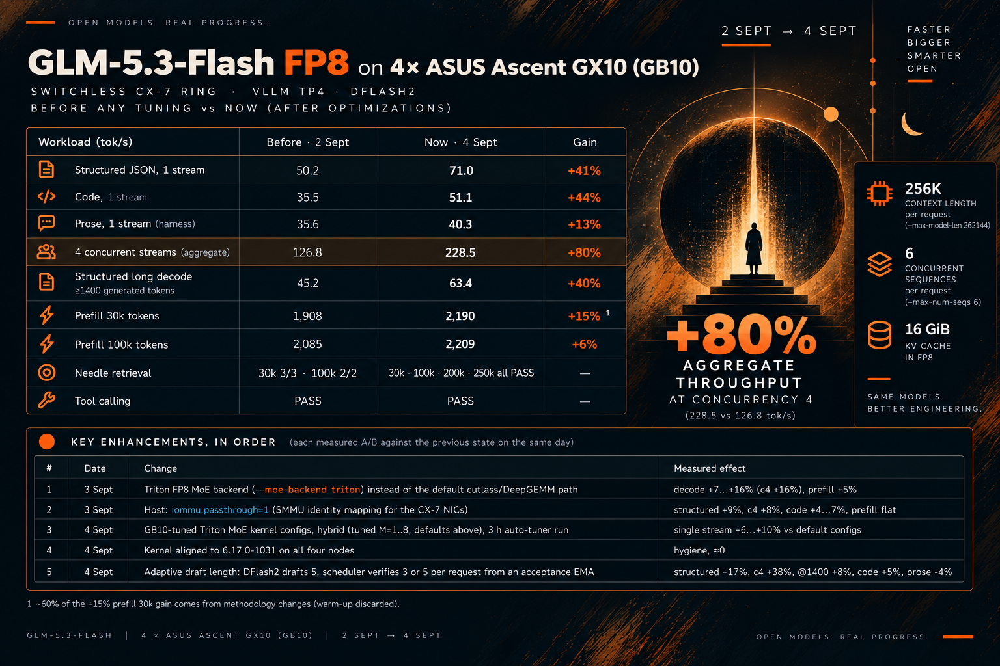

# GLM-5.3-Flash on 4× NVIDIA GB10 systems (verified on ASUS Ascent GX10)



**What this is.** FP8 + DFlash2, 256K context, switchless ring: a four-node inference cluster (one
NVIDIA GB10 per node — verified on ASUS Ascent GX10, [§ Verified hardware profile](#verified-hardware-profile)) serving
**GLM-5.3-Flash** under vLLM with tensor parallel 4: the official `zai-org` FP8 checkpoint, the
`incoai` DFlash2 drafter for speculative decoding, a **262144-token** context × 6 sequences with an
FP8 KV cache, and a **switchless ConnectX-7 RoCE ring** — four direct DAC links, no switch — driven
by a patched NCCL. Rank 0 exposes an OpenAI-compatible endpoint on `:8000`.
**Who it is for.** Anyone rebuilding this stack on the same hardware, and the operators (human or
agent) who run it. This repository *is* the cluster's infrastructure-as-code.
**Status.** Currently serving: **adaptive draft length v1, promoted 2026-09-04**; the production
recipe is [`cluster.env.example`](cluster.env.example).
**Licence.** The DFlash2 drafter is **CC BY-NC-ND 4.0** — non-commercial use only, no derivatives:
running this stack commercially means dropping the drafter or contacting inco.ai first.
**Security.** The endpoint binds `0.0.0.0` under `--network host` and has **no authentication**:
anyone who can reach rank 0 on port 8000 can use the model. Trusted LAN only — never expose it to
the internet. The deploy user holds `NOPASSWD:ALL` sudo on all four nodes, i.e. root-equivalent
access, which the launcher and `tp4ctl` require. Full threat model: [`SECURITY.md`](SECURITY.md).
**What you need.** 4× GB10 nodes, 4 DAC cables, ~330 GiB free per node, half a day.

## Headline results

<!-- perf-table:begin -->
<!-- generated by: python3 scripts/bench/perf-table.py --write-readme README.md --marker perf-table --compact --rows dflash2-k3,moe-triton,iommu-passthrough,moe-hybrid,adaptive-k-v1,prod-2026-09-04-adaptive-k — verify with the same flags and --check instead of --write-readme -->

| Date | Milestone | Structured x1 | Prose x1 (harness) | Code x1 | 4-stream aggregate | Prefill 100k |
|---|---|---|---|---|---|---|
| 2026-09-02 | FP8 + DFlash2 k=3 (START) (single-pass) | 50.2 | 35.6 | 35.5 | 126.8 | 2085.2 |
| 2026-09-03 | Triton MoE backend (production confirmation) (single-pass) | 52.5 | 40.1 | 45.1 | 143.5 | 2201.7 |
| 2026-09-03 | Host iommu.passthrough=1 (single-pass) | 57.2 | 43.4 | 47.0 | 154.3 | 2200.8 |
| 2026-09-04 | Hybrid GB10 MoE config (production confirmation) | 58.5 | 42.7 | 48.3 | 146.0 | 2177.5 |
| 2026-09-04 | Adaptive draft length v1 (overlay boot) | 68.6 | 40.9 | 50.5 | 200.7 | 1899.3 |
| 2026-09-04 | Adaptive draft length v1 (production) (today) | 71.0 | 40.3 | 51.1 | 228.5 | 2209.3 |
<!-- perf-table:end -->

**How to read it** (tok/s, higher is better; every cell re-extracted from the committed JSONs):

- **±5% is noise.** Three boots of the *identical* recipe on 2026-09-04 spread 5% on decode, so a
  single-boot delta inside that band is not a result. Only repeated, cross-workload gains were kept.
- **Two context families, one method change.** Rows up to 2026-09-02 ran at `524288 × 4`, later ones
  at `262144 × 6`; since W1 (2026-09-03) a warm-up pass is always discarded, which alone lifts
  prefill-30k. Window names: [`docs/bench.md` § Measurement windows](docs/bench.md#measurement-windows).
- **The full table and its caveats** — every column, the source JSON of each cell, the eight caveats:
  [`bench-results/README.md`](bench-results/README.md#performance-over-time). Narratives: [§ Evidence](#evidence).

### Key enhancements

| Date | Change | Measured effect |
| --- | --- | --- |
| 2026-09-03 | Triton FP8 MoE backend (`--moe-backend triton`) | decode +7..+16%, prefill +5% |
| 2026-09-03 | Host `iommu.passthrough=1` on all four nodes | structured +9%, c4 +8%, code +4..+7% |
| 2026-09-04 | GB10-tuned hybrid fused-MoE kernel config | single stream +6..+10% vs the vLLM default |
| 2026-09-04 | Kernel `6.17.0-1031-nvidia` on all four nodes | hygiene: one kernel, pinned, GRUB fallback kept |
| 2026-09-04 | Adaptive draft length (adaptive-k), k 3↔5 per request | structured +21%, c4 +56%, @1400 +17%, code +6%, prose −6% harness / 0% by hand vs fixed k=3 (two-pass production confirmation) |

**Closed without promotion:** fixed `SPEC_TOKENS` 5 and 7 (prose regression), drafter TP1 (neutral),
`BATCHED_TOKENS=16384` (no gain), `--moe-backend marlin` (prefill −6%), `NCCL_PROTO=LL` (slower), DeepGEMM E8M0 off (no gain), GPU clock lock (ineffective), GPUDirect RDMA (unsupported on GB10).

## Hardware

Four **NVIDIA GB10** nodes, ranks 0..3, aliased `<ALIAS_RANK0>`..`<ALIAS_RANK3>`; aliases, IPs
and login live only in the gitignored `cluster.env` ([§ Site configuration](#site-configuration)).
The measured platform is the **ASUS Ascent GX10** ([§ Verified hardware profile](#verified-hardware-profile)).

| Item | Value |
| --- | --- |
| SoC / GPU | NVIDIA GB10, compute capability `sm_121` (`compute_121`), one per node |
| Platform | ASUS Ascent GX10 (the verified profile below) |
| Memory | 128 GB unified per node |
| Storage | 1 TB NVMe per node (the FP8 checkpoint alone is ~306 GiB) |
| NIC | one ConnectX-7 (MT2910) per node, two physical QSFP ports |
| Management | 1 GbE on `enP7s7`, plus Tailscale SSH for remote access |
| Fabric | **4× QSFP28 DAC cables**, 200 Gb/s negotiated, MTU 9000 |
| Host kernel | `6.17.0-1031-nvidia`, pinned, booted with `iommu.passthrough=1` |

The four cables form a closed chain —
`<ALIAS_RANK0>↔<ALIAS_RANK1>↔<ALIAS_RANK2>↔<ALIAS_RANK3>↔<ALIAS_RANK0>`, no rank 0↔2 and no
rank 1↔3 link, one dedicated /24 per link. Cabling, ports, IP plan, re-addressing: [`docs/fabric.md`](docs/fabric.md).

### Verified hardware profile

Every number in this repository was measured on 4× **ASUS Ascent GX10**. Other GB10 systems (NVIDIA
DGX Spark and the other GB10 OEM boxes) are **expected to work but are not verified here**: the
platform-specific values are listed below, with the file that owns each one and how to override it.

| ASUS-specific value | Owned by | How to override |
| --- | --- | --- |
| CX-7 interface names `enp1s0f0np0`, `enp1s0f1np1`, `enP2p1s0f0np0`, `enP2p1s0f1np1` | `FABRIC_IFACES` in `cluster.env`, `IFACES` in [`node/etc/common/tp4-fabric-iptables.sh`](node/etc/common/tp4-fabric-iptables.sh), [`node/etc/40-cx7.yaml.example`](node/etc/40-cx7.yaml.example) | set `FABRIC_IFACES` and re-render the netplan (`scripts/render-netplan.sh`); edit `IFACES` to match |
| NCCL fabric env: `NCCL_IB_HCA=rocep1s0f0,rocep1s0f1`, `NCCL_IB_GID_INDEX=3`, RoCE v2 (`NCCL_IB_ROCE_VERSION_NUM=2`), `NCCL_IB_SUBNET_PREFIX_LEN=24`, `NCCL_{MIN,MAX}_NCHANNELS=4` | the fixed NCCL block of [`launcher/launch-glm53-tp4.sh`](launcher/launch-glm53-tp4.sh) | re-declare the same variable in `EXTRA_DOCKER_ENV` — it is appended **last** and wins over the block |
| Netplan `renderer: NetworkManager` (the ASUS image ships NM, not `networkd`) | [`node/etc/40-cx7.yaml.example`](node/etc/40-cx7.yaml.example) → the per-node `40-cx7.yaml` | change the `renderer:` line before `deploy-host.sh` pushes it |
| Kernel `6.17.0-1031-nvidia` (+ the held package set), driver `580.173.02`, CX-7 firmware, OS `Ubuntu 24.04.4 LTS`, docker/CTK/rdma-core minima | [`node/bootstrap/versions.env`](node/bootstrap/versions.env) | edit the pins there; `scripts/verify-node.sh` and `bootstrap-node.sh` read only that file |

## Site configuration

Every address, alias and login lives in files **you** create; none is ever committed.

- **`cluster.env`** — `cp cluster.env.example cluster.env` and fill *every* value: `NODES` (ssh
  aliases, rank order), `MGMT_IPS`, `MASTER_IP`, `MASTER_PORT`, `MGMT_IF`, `API_PORT`,
  `FABRIC_TARGETS`, `FABRIC_IFACES`, `RELAY_DEST`, paths. Gitignored; `scripts/lib/common.sh`
  refuses to run while a `<...>` placeholder is left in it.
- **Per-node netplan** — one `node/etc/<ALIAS_RANKn>/40-cx7.yaml` per node, from
  `node/etc/40-cx7.yaml.example`. Gitignored; pushed by `scripts/deploy-host.sh`.
- **ssh aliases** — each alias in `NODES` must equal that node's `hostname -s`.
- **sudoers and autostart** — rendered from `node/etc/common/99-tp4-nopasswd.example` and
  `node/tp4-autostart.service.example` by `scripts/bootstrap-node.sh --apply`.

`scripts/mirror-snapshot.sh` refuses to build a public snapshot that still contains a site value.

## Quickstart

**Building the cluster from bare nodes** — OS, NVIDIA driver and docker only — is the longer job
(kernel pin, `/etc` assets, ssh mesh, NCCL build, 306 GiB of weights, autostart): the ordered runbook
is [`docs/install-from-zero.md`](docs/install-from-zero.md); what production is, piece by piece and
by date, is [`docs/production-recipe.md`](docs/production-recipe.md).

**Daily operation (cluster already built)**

```bash
git clone https://github.com/jnardiello/tp4-glm53-fp8-gx10.git && cd tp4-glm53-fp8-gx10
# cluster.env and the per-node netplan files first — see § Site configuration
./scripts/deploy.sh                     # push env + launcher + tp4ctl + patches to the 4 nodes
./tp4ctl fabric-check                   # MTU/IP per node + 8-way jumbo ping matrix
./tp4ctl up                             # ~16 min to /health 200
./tp4ctl health                         # /health + a smoke chat completion
```

Then run the acceptance gate ([`docs/gate.md`](docs/gate.md)) before declaring the cluster good,
and point a client at [§ Using the endpoint](#using-the-endpoint).

## What runs

| Component | Value | Owned by |
| --- | --- | --- |
| Image | `ghcr.io/tonyd2wild/vllm-glm53-flash:sm121-v11-dflash2` (not built here) | [`cluster.env.example`](cluster.env.example), [`docs/image-rebuild-study.md`](docs/image-rebuild-study.md) |
| Weights | `zai-org/GLM-5.3-Flash`, FP8, 62 shards, ~306 GiB, mounted `/model:ro` | [`docs/weights.md`](docs/weights.md) |
| Drafter | `incoai/GLM-5.3-Flash-DFlash2`, 5 layers, `block_size` 8, 2.34 GB, `/draft:ro` | [`docs/weights.md`](docs/weights.md) |
| Parallelism | tensor parallel 4, one GPU per node, `--distributed-executor-backend mp` | [`cluster.env.example`](cluster.env.example) |
| Context | `max_model_len` 262144 × `max_num_seqs` 6 | [`cluster.env.example`](cluster.env.example) |
| KV cache | `fp8_e4m3`, pool pinned at 16 GiB per rank | [`cluster.env.example`](cluster.env.example) |
| MoE | Triton fused-MoE (`--moe-backend triton`) + the hybrid GB10-tuned kernel JSON, bind-mounted | [`node/moe-configs/`](node/moe-configs/), [`node/moe-tune/README.md`](node/moe-tune/README.md) |
| Speculative decoding | DFlash2, `SPEC_TOKENS=5`, **AdaptiveKScheduler**: the drafter always drafts 5, the scheduler verifies 3 or 5 per request from that request's own acceptance history — confirmed in production 2026-09-04 (two passes) at structured +21%, c4 +56%, @1400 +17%, code +6%, prose −6% harness / 0% by hand vs fixed k=3 | [`node/patches/README.md`](node/patches/README.md), [`docs/adaptive-k.md`](docs/adaptive-k.md) |
| Scheduling | `ASYNC_SCHEDULING=0` (no `--async-scheduling` flag; the base class is still `AsyncScheduler`, which the patch requires) | [`cluster.env.example`](cluster.env.example) |
| Patches into the container | sm_121 sparse-attention indexer K-pool fix; the adaptive-k scheduler module at `/opt/tp4`; `VLLM_MEMORY_PROFILER_ESTIMATE_CUDAGRAPHS=0` so the profiler does not double-count graph capture | [`node/patches/README.md`](node/patches/README.md) |
| NCCL | patched `libnccl.so.2` v2.30.7-1 with the `skip-tree-connect` overlay, preloaded from the host | [`node/nccl/README.md`](node/nccl/README.md), [`docs/nccl.md`](docs/nccl.md) |
| Host tier | `iommu.passthrough=1` via a GRUB drop-in; kernel `6.17.0-1031-nvidia`, pinned | [`node/host/README.md`](node/host/README.md), [`node/bootstrap/README.md`](node/bootstrap/README.md) |
| Model id | `glm-5.3-flash`, no API key | [`cluster.env.example`](cluster.env.example) |

## Operate

`./tp4ctl status | health | logs [node] | fabric-check | up | down | restart | poweroff` — the last
four are disruptive (they take the endpoint away) and rank 0's autostart brings the cluster back on
whatever is in `~/tp4/cluster.env`, tested or not.
`fabric-check` exits 0 = every fabric interface present and all jumbo pings OK, 1 = any degradation;
`tp4ctl up` refuses to start on 1. The change cycle is `$EDITOR cluster.env` → `./scripts/deploy.sh` (additive) → `./tp4ctl restart`
(disruptive) → sanity gate within two minutes of `/health` 200.
Experiments never edit a node: they are overlay `.env` files under
[`experiments/`](experiments/README.md), run with `TP4_ENV=<path>` on **every** subcommand.
Agents start at [`AGENTS.md`](AGENTS.md), not at this file. Runbooks:
[status-check](docs/agents/status-check.md) (what production serves right now, and the four
signatures `docker ps` cannot see), [deploy-cycle](docs/agents/deploy-cycle.md),
[promotion-checklist](docs/agents/promotion-checklist.md) and, when something is wrong,
[rollback](docs/agents/rollback.md).

## Reproduce and benchmark

The harness is client-side and lives in `scripts/bench/`; the protocol, metric definitions, prompts
and the measurement-window glossary are [`docs/bench.md`](docs/bench.md), the acceptance gate (needle
recall, tool call, decode floor) is [`docs/gate.md`](docs/gate.md), and the preconditions a measurement
must satisfy are [`docs/agents/bench-protocol.md`](docs/agents/bench-protocol.md).

```bash
RUNS=3 CONCURRENCY=4 LONG_DECODE=1 scripts/bench/run_ab.sh <label>   # the A/B pass
python3 scripts/bench/bench_decode.py --prompt code --out <file>     # by-hand code / prose decode
```

Every pass writes a JSON into `bench-results/`; adding a milestone to
[`bench-results/milestones.json`](bench-results/milestones.json) is what puts it in the table above.

## Evidence

- [`bench-results/README.md`](bench-results/README.md) — the index of every measured window: what was
  run, promoted or rejected, and the JSON files behind each note.
- [`bench-results/milestones.json`](bench-results/milestones.json) + `scripts/bench/perf-table.py` — the milestone manifest and its generator ([`README-perf-table.md`](scripts/bench/README-perf-table.md)).
- [`reports/2026-09-04-campaign-report.html`](reports/2026-09-04-campaign-report.html) — the tuning campaign, window by window.
- [`reports/2026-09-04-adaptive-k.html`](reports/2026-09-04-adaptive-k.html) — the adaptive draft length study, five variants and the decision.
- [`reports/2026-09-04-start-to-today.md`](reports/2026-09-04-start-to-today.md) — the start-to-today comparison in plain language.

## Why DFlash2

The checkpoint ships an MTP head, and MTP and DFlash are mutually exclusive. On this stack the MTP
head performs *k sequential draft steps* and rebuilds attention metadata between them (`Fused
multi-step draft decode is not supported by attention backend(s) …`); DFlash2 drafts the whole
8-token block in one pass.
Measured side by side on 2026-09-02 ([`bench-results/2026-09-02-fp8-mtp-vs-dflash.md`](bench-results/2026-09-02-fp8-mtp-vs-dflash.md)):
+50% on structured decode, +40% per-stream at concurrency 4, +32% on sustained long decode, at the
cost of 5-10% on single-stream prose.

## Historical context

On 2026-09-01 the same harness compared three lanes on the same hardware: **NVFP4** (RedHatAI
checkpoint), **EXL3 4bpw** (MiaAI-Lab), and **FP8 upstream**. NVFP4 was the fastest on decode
(~121-124 tok/s structured, roughly 2.4× the FP8 MTP lane) and matched FP8 on prefill; EXL3 was
competitive on sustained long decode but ~40% slower on prefill. FP8 was the only lane that never
missed a needle (3/3 and 2/2 in both passes) and the only one that sustained a 524288-token context
(production was later lowered to 262144 × 6 on 2026-09-02). FP8 was kept for those two reasons, the
repository was reduced to that single lane, and DFlash2 recovered most of the decode gap. Windows:
[`3way-final`](bench-results/2026-09-01-3way-final.md), [`nvfp4`](bench-results/2026-09-01-nvfp4.md),
[`exl3-window`](bench-results/2026-09-01-exl3-window.md).
**DSpark** — DeepSeek's speculative decoding method, arXiv 2607.05147, unrelated to the DGX Spark
hardware despite the name — was evaluated and found not applicable: no drafter exists for
GLM-5.3-Flash.

## Troubleshooting

| Symptom | Cause / fix |
| --- | --- |
| Dies right after 62/62 shards: `persistent_topk … >=128KB smem` | The indexer patch is not mounted, or the node has a stale copy. Re-run `./scripts/deploy.sh` (it lands as `~/patches/sparse_attn_indexer_kpool.py`). With an older `sm121-v8`-style image the equivalent fix is the two `sparse_attn_indexer*.py` mounts instead of the single kpool one. |
| Dies at 62/62 with `pe_dim must be 64 for fp8_ds_mla` | Wrong image: one without the SM121 layers, which selects the wrong attention backend. Use the `sm121-v11-dflash2` tag from `cluster.env`. |
| vLLM refuses the fp8 KV cache together with `dflash` (vLLM issue #41559) | The drafter's non-causal attention. Add `"kv_cache_dtype":"auto"` **inside** the speculative config: the drafter's KV goes bf16, the target's KV stays fp8. Not needed on the current image. |
| `NV_ERR_NO_MEMORY` on rank 0 | Rank 0 also runs the API process. Lower the KV pool to 14 GiB (`--kv-cache-memory=15032385536` in `EXTRA_VLLM_ARGS`). **Never** raise `GPU_MEM_UTIL` above 0.85. |
| Clock wedge / GPU burning at boot | A live container holds the GPU busy even with the driver idle. `./tp4ctl down` (or `sudo docker rm -f "$CONTAINER"` on the node), then check `nvidia-smi --query-gpu=clocks.current.sm`: under 1500 MHz means the node is wedged and needs a cold reset. |
| NCCL initialization timeout | Ring/fabric problem. Check MTU and links with `./tp4ctl fabric-check`, then work through [`docs/nccl.md`](docs/nccl.md); verify the preloaded library is the patched one (`sha256sum ~/nccl-patched/libnccl.so.2`). |
| `Duplicate NCCL runtime` warning from deep_ep | Benign, and expected: it is the preloaded library coexisting with the one linked into the image. It has never been the cause of a fabric problem. |
| Weight load wedges with no error and no log line | The page-cache flusher is not running. `tp4ctl up` starts it as a transient `systemd-run` unit on every node and stops it at `/health` 200; without it a large KV pool can stall the load silently. |
| 10+ minutes with no log output during `up` | Normal. 62 shards take about 10 minutes, then warmup and CUDA graph capture. Do not retry `up` while it is running. |
| Serving is up but roughly 2.7× slower than the numbers above | Almost certainly a fabric port back at MTU 1500. `./tp4ctl fabric-check`. |
| `tp4ctl` hangs in wait-peers for 10 minutes on rank 0 | Rank 0 cannot ssh to itself: no sshd listener, or its own key missing from its `authorized_keys`. |

## Using the endpoint

Placeholders: `<MGMT_IP_RANK0>` is rank 0's management IP (`MASTER_IP` in `cluster.env`); every
`<UPPER_CASE>` token in this repository is a local value you substitute with your own.

```
http://<MGMT_IP_RANK0>:8000/v1        # MASTER_IP and API_PORT from cluster.env
model id: glm-5.3-flash
API key:  none required (send any placeholder if your client insists)
```

`./tp4ctl health` already sends a smoke chat completion against that endpoint. Any OpenAI-compatible
client works; set the context window to what `GET /v1/models` reports (`max_model_len` **262144**),
not to a hardcoded guess. For opencode and pi, the provider block is:

```json
{
  "baseUrl": "http://<MGMT_IP_RANK0>:8000/v1",
  "api": "openai-completions",
  "apiKey": "none",
  "models": [
    { "id": "glm-5.3-flash", "contextWindow": 262144, "maxTokens": 32768 }
  ]
}
```

## Layout

```
README.md                     this file — the human entry point
AGENTS.md                     agent entry point: hosts, login, recipe, safety rules
CLAUDE.md                     imports AGENTS.md for Claude Code
cluster.env.example           the annotated production recipe (cluster.env is gitignored)
tp4ctl                        orchestrator: status/health/logs/fabric-check/up/down/restart/poweroff
launcher/
  launch-glm53-tp4.sh         per-rank launcher, runs on the node from ~/tp4/
scripts/
  deploy.sh                   push env + launcher + tp4ctl + patches + MoE configs (sha256 verified)
  deploy-host.sh              push /etc assets and host knob scripts; additive, never reboots
  bootstrap-node.sh           bring a node from OS+driver+docker to cluster-ready (--check/--apply)
  verify-node.sh              read-only PASS/FAIL audit of all four nodes
  lib/common.sh               shared loader/ssh/log helpers for the workstation scripts
  fetch-fp8-weights.sh        download the FP8 checkpoint on rank 0, fan out over the ring
  mirror-snapshot.sh          build and scan the sanitized public snapshot
  nccl-bench.sh               fabric microbenchmark driver
  prof-capture.sh             Nsight Systems capture on rank 0
  bench/                      A/B harness: run_ab, bench_prefill/decode/longctx, compare, perf-table
docs/
  install-from-zero, production-recipe, fabric, nccl, weights, gate, bench, adaptive-k
  (+ -recon), image-rebuild-study, external-recipes, agents/ (5 runbooks)
node/
  README-node-assets.md       node assets: what goes where, with owners and permissions
  flusher-unconditional.sh    page-cache flusher, run during weight load
  sparse_attn_indexer_kpool_sm121.py   sm_121 indexer fix, mounted over the vLLM module
  tp4-autostart.service.example        systemd unit template, rank 0 boot-time start
  bootstrap/                  versions.env (pinned kernel/driver) + bootstrap notes
  patches/                    container-mounted Python patches (adaptive_k_scheduler.py + tests)
  host/                       one script per host knob (tp4-iommu.sh) + verdicts
  moe-configs/                GB10-tuned fused-MoE kernel JSONs (hybrid = production)
  moe-tune/                   the fused-MoE tuner that produces them
  nccl/                       vendored NCCL build: Dockerfile, build.sh, patch, SHA256SUMS
  nccl-bench/                 fabric all-reduce microbenchmark container assets
  etc/                        sysctl, fabric iptables unit, sudoers + netplan templates
experiments/                  overlay .env files, one per measured window, each with its verdict
bench-results/                run JSONs, per-window notes, README index, milestones.json
reports/                      published campaign and comparison reports
```

## Credits and licenses

A personal, unsupported project: no warranty, no support, no affiliation with NVIDIA, ASUS or Z.ai.
This repository is glue: the hard parts are other people's work.

- **Model** — [`zai-org/GLM-5.3-Flash`](https://huggingface.co/zai-org/GLM-5.3-Flash) by Z.ai; FP8 checkpoint, served as published, model card declares **MIT**.
- **Drafter** — [`incoai/GLM-5.3-Flash-DFlash2`](https://huggingface.co/incoai/GLM-5.3-Flash-DFlash2)
  by inco.ai, under **CC BY-NC-ND 4.0**: **non-commercial only, no derivatives**. Running this stack
  commercially means contacting inco.ai or dropping the drafter.
- **Container image and SM121 patch chain** — `tonyd2wild` (`ghcr.io/tonyd2wild/vllm-glm53-flash`),
  including the DFlash2 overlay. The original FP8 four-node DGX Spark recipe this lane descends from:
  [Wpnx330/GLM-5.3-Flash-FP8-4x-DGX-Spark](https://github.com/Wpnx330/GLM-5.3-Flash-FP8-4x-DGX-Spark).
- **NCCL patch** — `josephdrose/nccl-spark-switchless`, the `skip-tree-connect` overlay on NVIDIA NCCL v2.30.7-1, without which a switchless ring does not bootstrap.
- **MiaAI-Lab** — the EXL3 lane of the 2026-09-01 comparison and the protocol this harness follows.
- **vLLM** — the serving engine, including PR #52816 (DFlash) and the GLM-5.3 support work.
- **NVIDIA / ASUS** — GB10, ConnectX-7, and the Ascent GX10 platform.

Licence: MIT for the original code and documentation in this repository (see `LICENSE`), with the
exception of four vLLM-derived files (Apache-2.0) and the vendored NCCL patch (BSD-3 NCCL + an
upstream overlay published without a licence file); the model weights (MIT per the HF card), the
DFlash2 drafter (CC BY-NC-ND 4.0, non-commercial, no derivatives) and the container image keep their
own licences. Full matrix: [`THIRD_PARTY_NOTICES.md`](THIRD_PARTY_NOTICES.md).
